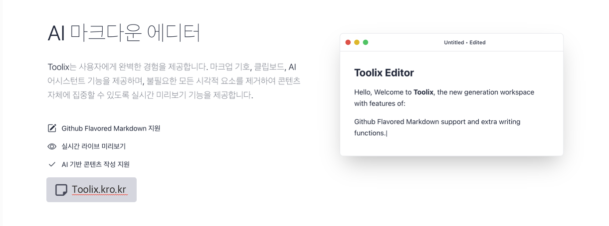
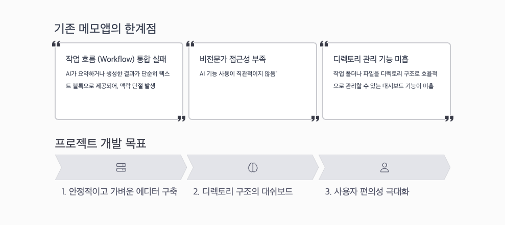
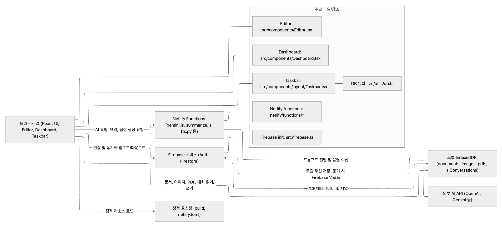
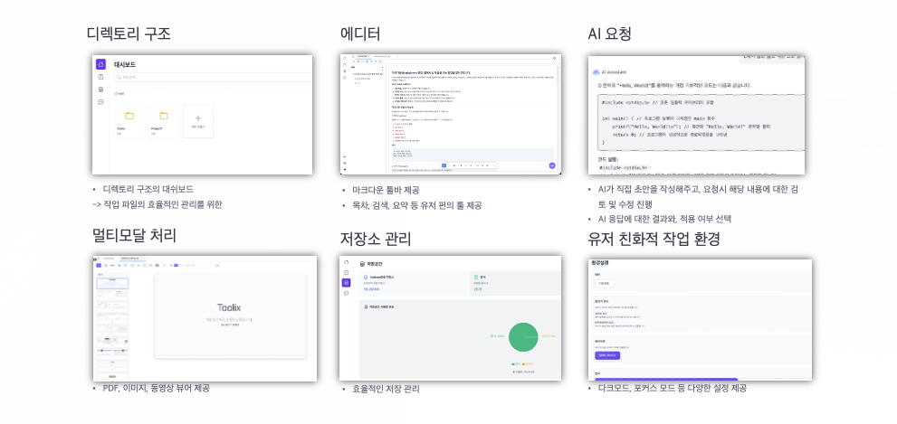
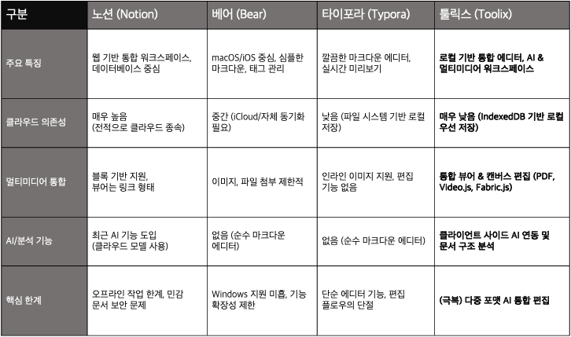

# AI Web Editor (Toolix)

**프로젝트 기간**: 2025.09.01 ~ 2025.11.20

## 1. 배포 사이트 (Deployment)
**🔗 [https://toolix.kro.kr](https://toolix.kro.kr)**

지금 바로 Toolix 웹사이트에 접속하여 AI 에디터를 직접 체험해보세요.

## 2. 소개 (Introduction)

**Toolix**는 최신 **AI 기술(Google Generative AI)**과 강력한 **Rich Text Editor(Tiptap)**를 결합하여 웹 콘텐츠 제작의 혁신을 목표로 하는 프로젝트입니다. 
단순한 텍스트 편집을 넘어, AI가 문맥을 이해하고 텍스트를 생성하거나 교정해 주며, 사용자의 의도를 파악하여 최적의 글쓰기 경험을 제공합니다. 
직관적인 UI와 스마트한 기능으로 누구나 전문가 수준의 콘텐츠를 쉽고 빠르게 제작할 수 있습니다.

## 3. 개발 목표 (Development Goals)

- **콘텐츠 생산성 극대화**: AI 보조 도구를 통해 작성 시간을 단축하고 창작의 고통을 줄입니다.
- **사용자 중심 경험**: 직관적인 인터페이스(UI/UX)로 복잡한 코딩 없이 웹 문서를 스타일링합니다.
- **지능형 에디터**: 단순 타이핑을 넘어 AI와 협업하는 새로운 저작 환경을 제시합니다.

## 4. 시스템 아키텍처 (System Architecture)

### Tech Stack
- **Frontend**: React, TypeScript, Vite
- **UI/Styling**: Radix UI, Tailwind CSS
    - **Editor Core**: Tiptap (Headless WYSIWYG Editor)
- **AI Engine**: Google Generative AI (Gemini)
- **Backend/Service**: Firebase

## 5. 주요 기능 (Features)

### AI Writing Assistant
Google의 생성형 AI 모델을 연동하여, 사용자의 입력을 바탕으로 글의 초안을 작성하거나, 문체를 다듬고 요약하는 기능을 제공합니다.

### Advanced Rich Text Editor
Tiptap 기반의 에디터를 통해 코드 블록, 표, 이미지 삽입, 할 일 목록(Task List) 등 복잡한 서식을 손쉽게 적용할 수 있습니다.

## 6. 시연 영상 (Demo)

## 7. 유사 서비스 비교 (Comparison)

기존의 일반적인 텍스트 에디터나 경쟁 서비스들과 비교하여, Toolix는 **AI 자동 생성** 기능이 강력하게 통합된 차세대 저작 도구로서의 차별성을 가집니다.

---
*GitHub Repository: [https://github.com/Song307/AI-Web-Editer](https://github.com/Song307/AI-Web-Editer)*
